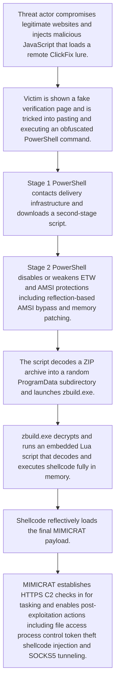

# MIMICRAT ClickFix campaign delivering a custom Windows RAT via compromised legitimate websites

- Source: clickFix
- Intake mode: link
- Reference: https://www.elastic.co/security-labs/mimicrat-custom-rat-mimics-c2-frameworks
- Risk level: high
- Confidence: high

## Executive Summary
Elastic Security Labs describes an active February 2026 ClickFix campaign that abuses compromised legitimate websites to socially engineer users into running an obfuscated PowerShell command. The infection chain progresses through a second-stage PowerShell payload that disables ETW and AMSI protections, extracts and launches a Lua-based loader, executes shellcode in memory, and ultimately deploys MIMICRAT, a bespoke Windows RAT. MIMICRAT supports encrypted HTTPS C2, file operations, process execution, token theft/impersonation, shellcode injection, and SOCKS5 tunneling. The provided detection catalog has only partial overlap, primarily around obfuscated PowerShell execution, and lacks material coverage for the ClickFix delivery pattern, AMSI/ETW bypass, Lua loader execution, MIMICRAT-specific C2, token theft, and SOCKS functionality.

## Attack Diagram

## Existing Detection Coverage
- Coverage exists: yes
- Coverage summary: The current catalog provides limited partial coverage. The strongest overlap is a generic detection for obfuscated PowerShell, which is relevant because Elastic observed suspicious obfuscated PowerShell as the initial execution vector. However, the catalog does not materially cover the campaign's distinctive behaviors: ClickFix delivery, ETW/AMSI bypass, AMSI memory patching, Lua loader execution, ProgramData extraction pattern, MIMICRAT C2 over HTTPS, token theft/impersonation, shellcode injection, or SOCKS5 tunneling.

- `Detections/APT29 - Cozy Bear/Defense Evasion - T1027.7.yml`: Material overlap with the observed obfuscated PowerShell execution used in the initial stages of the infection chain.

## Attack Logic
- Threat actor compromises legitimate websites and injects malicious JavaScript that loads a remote ClickFix lure.
- Victim is shown a fake verification page and is tricked into pasting and executing an obfuscated PowerShell command.
- Stage 1 PowerShell contacts delivery infrastructure and downloads a second-stage script.
- Stage 2 PowerShell disables or weakens ETW and AMSI protections, including reflection-based AMSI bypass and memory patching.
- The script decodes a ZIP archive into a random %ProgramData% subdirectory and launches zbuild.exe.
- zbuild.exe decrypts and runs an embedded Lua script that decodes and executes shellcode fully in memory.
- Shellcode reflectively loads the final MIMICRAT payload.
- MIMICRAT establishes HTTPS C2, checks in for tasking, and enables post-exploitation actions including file access, process control, token theft, shellcode injection, and SOCKS5 tunneling.

## Impacted Systems
- Windows
- Windows x64 endpoints
- PowerShell-enabled enterprise workstations

## Likely Targets
- Users visiting compromised legitimate websites
- Enterprise Windows endpoints
- Organizations across multiple industries and geographies
- Victims susceptible to ClickFix social-engineering lures

## TTPs
- ClickFix social engineering
- User execution via PowerShell one-liner
- Obfuscated PowerShell
- Compromised website delivery infrastructure
- ETW bypass
- AMSI bypass via reflection
- AMSI memory patching
- Archive extraction into %ProgramData%
- Lua-based loader execution
- In-memory shellcode execution
- Reflective payload loading
- HTTPS command and control
- Token theft and impersonation
- Interactive shell
- Shellcode injection
- SOCKS5 proxy/tunneling

## Tooling And Malware
- MIMICRAT
- PowerShell
- zbuild.exe
- Custom Lua 5.4.7 loader
- Shellcode loader consistent with Meterpreter code-family
- ClickFix lure

## Indicators Of Compromise
| Type | Value | Context |
| --- | --- | --- |
| sha256 | bcc7a0e53ebc62c77b7b6e3585166bfd7164f65a8115e7c8bda568279ab4f6f1 | Stage 1 PowerShell payload |
| sha256 | 5e0a30d8d91d5fd46da73f3e6555936233d870ac789ca7dd64c9d3cc74719f51 | Lua loader |
| sha256 | a508d0bb583dc6e5f97b6094f8f910b5b6f2b9d5528c04e4dee62c343fce6f4b | MIMICRAT beacon |
| sha256 | 055336daf2ac9d5bbc329fd52bb539085d00e2302fa75a0c7e9d52f540b28beb | Related beacon sample |
| ipv4 | 45.13.212.251 | Payload delivery infrastructure |
| ipv4 | 45.13.212.250 | Payload delivery infrastructure |
| ipv4 | 23.227.202.114 | Post-exploitation C2 |
| domain | xmri.network | Stage 1 C2 / payload delivery |
| domain | wexmri.cc | Stage 1 C2 alternate |
| domain | www.ndibstersoft.com | Post-exploitation C2 |
| domain | d15mawx0xveem1.cloudfront.net | Post-exploitation C2 hostname in configuration |
| url | www.investonline.in/js/jq.php | Malicious JavaScript payload host on a compromised site |
| url | backupdailyawss.s3.us-east-1.amazonaws.com/rgen.zip | Payload delivery URL |
| file_name | zbuild.exe | Extracted binary launched from the dropped ZIP |
| file_path_pattern | %ProgramData%\knz_{random} | Random extraction directory used before executing zbuild.exe |
| uri_path | /intake/organizations/events?channel=app | HTTP GET profile for MIMICRAT check-in/tasking |
| uri_path | /discover/pcversion/metrics?clientver=ds | HTTP POST profile for MIMICRAT data exfiltration |
| cookie | AFUAK | HTTP GET profile cookie |
| cookie | BLA | HTTP GET profile cookie |
| cookie | HFK | HTTP GET profile cookie |
| cookie | ARCHUID | HTTP POST profile cookie |
| cookie | BRCHD | HTTP POST profile cookie |
| cookie | ZRCHUSR | HTTP POST profile cookie |
| user_agent | Mozilla/5.0 (Windows NT 10.0; Win64; x64; Cortana 1.14.9.19041; ...) Edge/18.19045 | HTTP GET profile user-agent |
| http_header | Accept-Language: zh-CN,zh;q=0.9 | HTTP GET profile header |
| referer | https://www.google.com/?q=dj1 | HTTP GET profile referer |
| referer | https://gsov.google.com/ | HTTP POST profile referer |
| crypto_key | abcdefghijklmnop | Hardcoded AES IV used in C2 traffic |

## Recommendations
- Add detections for ClickFix-style clipboard-to-Run/PowerShell execution and minimized obfuscated PowerShell one-liners.
- Create analytics for PowerShell ETW tampering against System.Diagnostics.Eventing.EventProvider and AMSI bypass behavior involving AmsiUtils and amsiInitFailed.
- Alert on runtime memory patching of AMSI-related methods and suspicious Marshal.Copy use within PowerShell.
- Monitor for ZIP extraction and execution of binaries from randomly named %ProgramData% subdirectories such as knz_* followed by zbuild.exe launch.
- Hunt for outbound HTTPS traffic matching the documented URIs, cookie names, and CloudFront/C2 hostnames associated with MIMICRAT.
- Add process and memory detections for Lua-embedded loaders, in-memory shellcode execution, and reflective loading activity.
- Monitor for token theft, impersonation, and unusual process creation using stolen tokens.
- Block or inspect access to the listed delivery and C2 infrastructure and pivot on related infrastructure sharing the same IPs.
- Use the published YARA rule and hashes for file and memory scanning where supported.

## References
- https://www.elastic.co/security-labs/mimicrat-custom-rat-mimics-c2-frameworks
